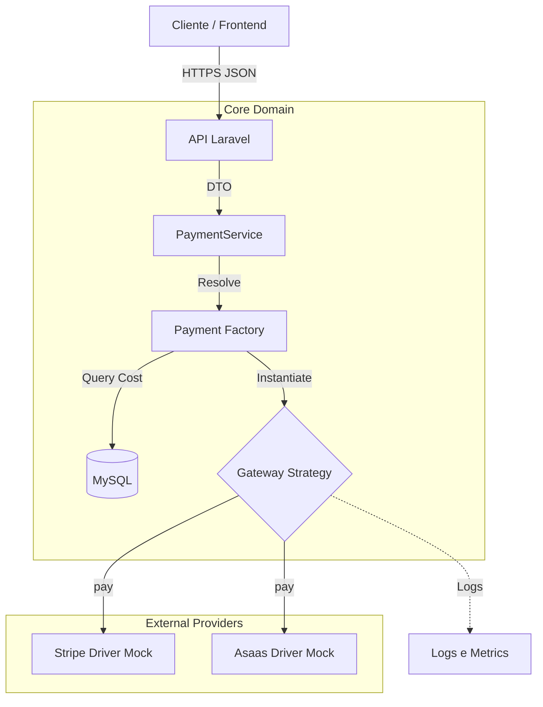
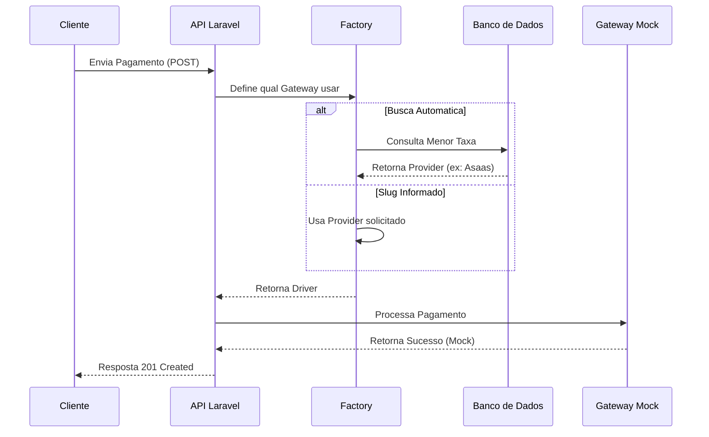

# Sistema de Pagamentos Multi-Provider

API RESTful desenvolvida em **Laravel** para orquestrar pagamentos entre múltiplos provedores (ex: Stripe, Asaas). O projeto foca numa arquitetura desacoplada e extensível, simulando um ambiente real de transações financeiras utilizando **Design Patterns** e Mocks.

---

## 🛠 Tecnologias Utilizadas

- **PHP 8.2+**
- **Laravel 10/11**
- **Laravel Sail** 
- **Laravel Sanctum**
- **MySQL** 

---

## 🚀 Instalação e Execução

Este projeto utiliza **Laravel Sail**. Não é necessário ter PHP ou Composer instalados localmente, apenas o **Docker**.

### 1. Clonar e Instalar
```bash
# Clone o repositório
git clone https://github.com/debritodev/teste-dubpay.git

# Instalar dependências via container temporário
docker run --rm \
    -u "$(id -u):$(id -g)" \
    -v "$(pwd):/var/www/html" \
    -w /var/www/html \
    laravelsail/php82-composer:latest \
    composer install --ignore-platform-reqs
```

### 2. Subir o Ambiente
```
./vendor/bin/sail up -d
```

### 3. Configuração Inicial
```bash
# Copiar env e gerar chave
cp .env.example .env
./vendor/bin/sail artisan key:generate

# Rodar migrações
./vendor/bin/sail artisan migrate --seed
```

---

## 🏛 Arquitetura e Design (Implementação)

O projeto foi construído sobre uma arquitetura de serviços robusta, focada em extensibilidade e regras de negócio dinâmicas.

### Destaques do Código:

- **Factory & Strategy Pattern:**
  Implementação de uma `PaymentFactory` que decide dinamicamente qual driver instanciar (`Stripe` ou `Asaas`) através da interface `PaymentGatewayInterface`.
  *O sistema utiliza implementações **Mock** desses drivers para simular respostas de sucesso/erro sem dependências externas.*

- **Smart Routing (Roteamento Inteligente):**
  Lógica desenvolvida para reduzir custos operacionais. Se nenhum provedor for especificado, o sistema consulta automaticamente o banco de dados para selecionar o gateway ativo com a **menor taxa de serviço (`base_fee_percentage`)** no momento da transação.

- **Service Layer:**
  Isolamento total da lógica de integração, mantendo os Controllers limpos e focados apenas na resposta HTTP.


---

## 📘 Documentação de Design do Sistema

Abaixo detalhamos as decisões de design para atender aos requisitos de alta disponibilidade, segurança e observabilidade.

### 1. Diagrama de Alto Nível (Componentes)
Estrutura de comunicação entre os serviços e a camada de abstração dos gateways.


### 2. Fluxo da Aplicação


---

## 🔮 Melhorias Futuras (Roadmap)

Pontos mapeados para evolução do projeto:

- [ ] **Testes Automatizados:** Implementação de testes unitários e de integração (Pest/PHPUnit).
- [ ] **Integração Real:** Substituir os drivers Mock pelos SDKs oficiais do Stripe e Asaas.
- [ ] **Filas (Queues):** Processamento assíncrono de webhooks para garantir resiliência.
- [ ] **Atomic Locks:** Implementação via Redis para garantir idempotência em pagamentos duplicados.